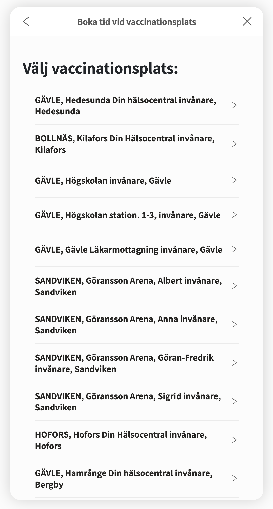
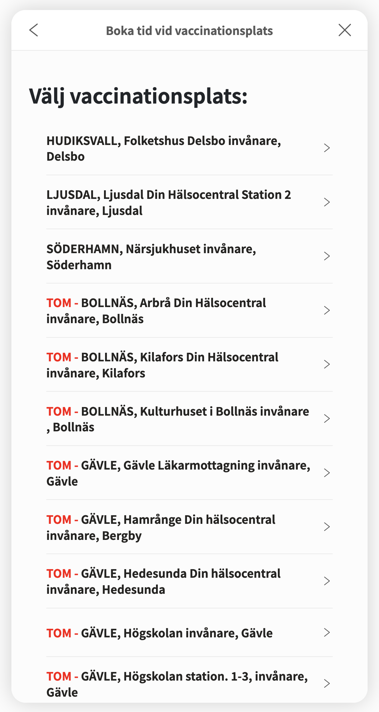

# Covid vaccine booking fix for Region Gävleborg
Small JS fixes for the covid vaccine booking page in Region Gävleborg. Sorts the list and checks if any place has available times, empty places get sorted to the bottom with a `"TOM - "` prefix.

Run the script in web console manually, add to Tampermonkey or create an extension for it. A time showed up while writing the script so I didn't get further than the web console.

## Before

## After

